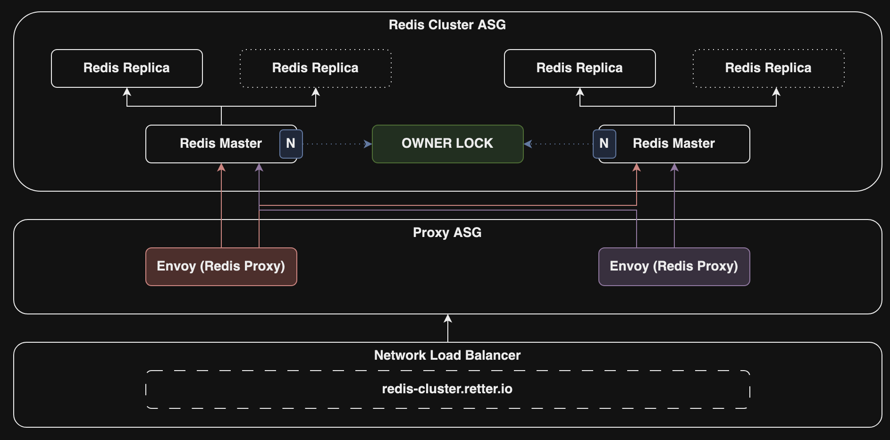

# Redis Cluster

This is an AWS CDK stack to deploy an automatically scalable, highly available and distributed Redis cluster on AWS.



## How does it work?

...

## Configuration

You can configure some resources via package.json file.

```json
{
    ...
    "cluster": {
        "cache": {
            "type": "t4g.nano",
            "master": 1,
            "replicas": 1
        }
    }
}
```

| Name                   | Description                                        | Default  |
| ---------------------- | -------------------------------------------------- | -------: |
| cluster.type     | AWS EC2 Instance Type for cache nodes              | t4g.nano |
| cluster.master   | How many master nodes will be deployed             |        1 |
| cluster.replicas | How many replicas will be deployed for each master |        1 |

## Deployment

```bash
npm install
npm run deploy
```

When you run "deploy" command, it will ask you about which AWS account you are going to deploy your stack?
To be able to pick a suitable account, you should configure them via AWS CLI.
