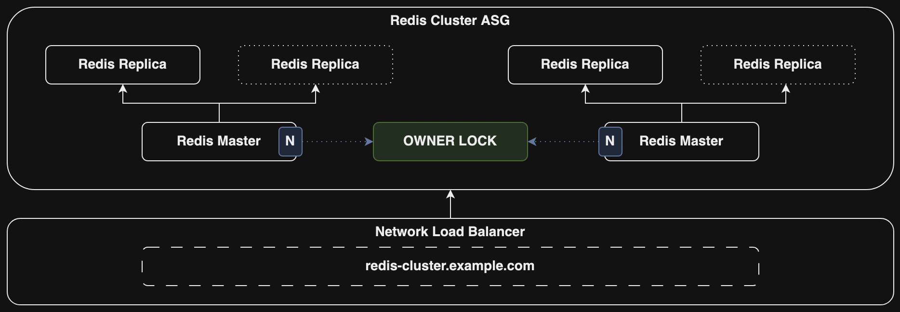

# Redis Cluster

This is an AWS CDK stack to deploy an automatically scalable, highly available and distributed Redis cluster on AWS.



## How does it work?

There are two *Auto Scaling Groups* in the stack.
One of them is for managing the Redis cluster and the other one is for proxy nodes.
An orchestration script runs on each instance and check the health of the Redis cluster periodically.
There is a Network Load Balancer in front of the Auto Scaling Group for the proxies.

## Configuration

You can configure some resources via package.json file.

```json
{
    ...
    "cluster": {
        "cache": {
            "type": "t4g.nano",
            "master": 1,
            "replicas": 1
        },
        "proxy": {
            "type": "t4g.nano",
            "count": 1
        }
    }
}
```

| Name                   | Description                                        | Default  |
| ---------------------- | -------------------------------------------------- | -------: |
| cluster.cache.type     | AWS EC2 Instance Type for cache nodes              | t4g.nano |
| cluster.cache.master   | How many master nodes will be deployed             |        1 |
| cluster.cache.replicas | How many replicas will be deployed for each master |        1 |
| cluster.proxy.type     | AWS EC2 Instance Type for proxy nodes              | t4g.nano |
| cluster.proxy.count    | How many proxy nodes will be deployed              |        1 |

## Deployment

```bash
npm install
npm run deploy
```

When you run "deploy" command, it will ask you about which AWS account you are going to deploy your stack?
To be able to pick a suitable account, you should configure them via AWS CLI.
